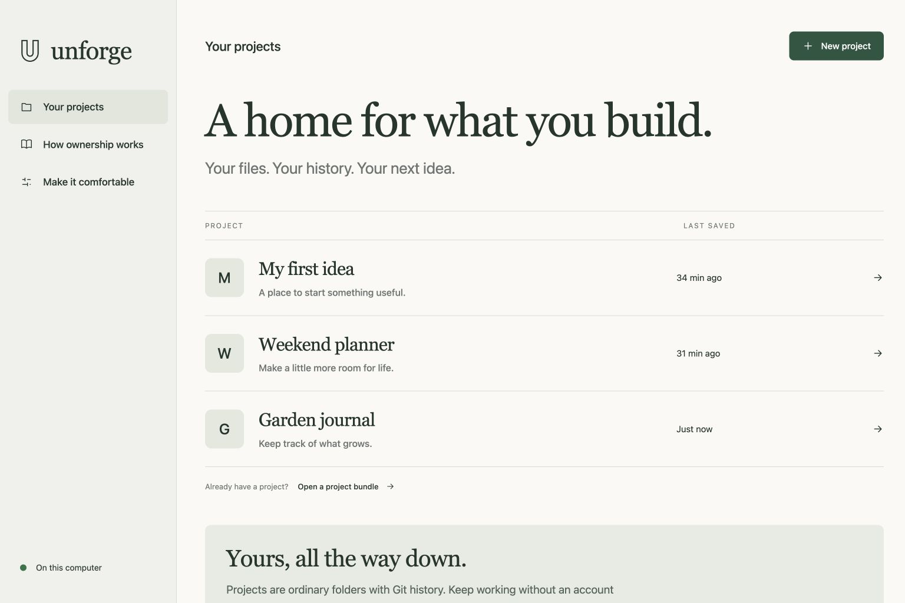

# Unforge

**Built for humans. Operated by AI. Owned by you.**

A local home for software you own. Keep its files, history, purpose, operating decisions, and recovery material together—without a GitHub account, a hosted database, or an Unforge subscription.

Unforge is an open-source **working alpha**. The current source adds folder adoption, durable drafts and agent proposals, local app execution with persistent data, and encrypted workspace backups to storage you already own. You can record requests for any coding agent, or optionally use an existing configured Codex CLI to prepare a proposal in a separate checkout. Review and apply the proposal before saving a version.

## Start locally

**Mac app:** a native AppKit/WebKit application packages the interface and Python engine. Open `Unforge.app` to use your existing workspace without Terminal, Python or Node setup. It requires macOS 13+ and Git 2.30+. The published arm64 zip is Developer ID signed, notarized, and stapled. Source builds on other Macs use a Developer ID Application identity when one is in the local Keychain, and notarize when local notary credentials are present; otherwise they stay ad-hoc. See [Mac app build and installation](docs/MAC_APP.md).

**Browser/CLI version:** on macOS or Linux, a built source release needs **Python 3.10+** and **Git 2.30+**. Building from source additionally needs **Node.js 22.12+ with npm**. Download and extract an archive from [Releases](https://github.com/Viiberr1128/unforge/releases), or obtain the source, then open its folder in a terminal:

```sh
./start.sh
```

Open **http://127.0.0.1:4319**. On macOS, you can also double-click `start.command`, which starts the app and opens your browser. Keep its terminal open while using Unforge; press **Control-C** there to stop it.

If the built interface is absent, the first start installs pinned frontend dependencies with `npm ci --ignore-scripts` and builds it. That source setup requires Internet access. A built release includes the interface and skips this download. The core app runs locally without telemetry or a required cloud account. Optional Codex jobs contact the configured provider and use your existing account allowance or charges. There is no hard dollar cap; the execution timeout is not a spending guarantee.

## What you can do today

- Create managed local Git projects, import a supported Git bundle, or review and copy a local app folder without modifying its original.
- Recover editor drafts and completed agent proposals after reopening Unforge.
- Run trusted static, Node, Python and Swift apps from separate saved source copies; use disposable previews or persistent managed app data.
- Execute configured checks locally, with bounded output and process cleanup.
- Open isolated Git worktree lanes so people and agents can commit without sharing the live checkout; restack overlapping work instead of overwriting it; merge stacked lanes onto live source.
- Run a local check graph with result cache, then publish a checked version to a bound destination — a folder, Cloudflare Pages on YOUR account, or Supabase functions on YOUR project — and observe that the URL actually serves that version. Any domain works. GitHub absence is computed from remotes, check receipts, and that observation — it cannot be asserted by hand.
- Create encrypted workspace recovery points in iCloud Drive, a Google Drive desktop sync folder, or another drive; verify a complete local restore before marking a copy complete.
- Automatically back up reported changes while Unforge is open; the Mac build also watches changes from external editors.
- Adjust text size and technical-detail preferences.
- Read and edit small text files (up to 128 KiB each; the interface loads files and history in pages).
- Preview a static HTML page with scripts disabled.
- Save named versions as ordinary Git commits.
- Restore a saved version as a new commit when the working directory is clean.
- Export committed history as a standard Git bundle.
- Inspect recognized dependency and hosting configuration clues, with file/line evidence.
- Keep a portable project brief, behavior examples, setup notes, decisions, and credential locations without secret values.
- Record services, estimated monthly ranges with their sources, shared dependencies, and evidence about what remains active.
- Compare configuration consequences of a Codex proposal and prepare a behavior-preserving simplification request.
- Record what happened when you tried a behavior in your own app, without confusing that observation with an automated test.
- Set one daily attempt allowance across this workspace's routed Codex and practice actions; replay an operation ID without starting it twice.
- Try built-in pretend email, payment, and webhook actions that produce local receipts without contacting a provider.
- Capture saved source and explicitly declared local data, rehearse its reconstruction, and restore a separate project copy.
- Complete a retirement plan after accounting for detected service references, shared resources, and a verified recovery capsule.
- Record a plain-language request under `.unforge/requests/` for handoff to your preferred coding agent.
- Optionally ask an installed, signed-in Codex CLI for an isolated proposal, review its diff, and apply it explicitly.

Saving a file and saving a version are separate steps. Save a version before exporting changes you want to preserve. Bundle upload accepts up to 20 MiB; local-path import through the CLI accepts up to 512 MiB. Imports require a supported current tree without symbolic links, submodules, or reserved files, with at most 128 MiB of file contents and 10,000 files.

The dependency and consequences views use bounded source inspection. They cannot determine actual invoices, deployed settings, or data flows. Recorded monthly ranges are your estimates with provenance. An attempt allowance limits how many routed actions start, not how much a provider charges for one action or for work started elsewhere.

Unforge runs in a native Mac window or local browser, backed by the same Python engine. Public deployment adapters, live provider billing controls, peer collaboration, complete support for every repository type, isolated execution of untrusted apps, and notarized desktop distribution remain on the [roadmap](docs/ROADMAP.md). Built-in practice actions demonstrate a local operation ledger; they do not sandbox your app or switch its real integrations into test mode.

## Start with one useful project

1. Create a project or import a supported Git bundle. In **Project care → Your brief**, describe what it is for and one behavior that must keep working, such as “Save a note, reopen the app, and find it again.” Write the notes, then **Save a version**.
2. In **Services & costs**, record the accounts and resources the project depends on. Leave unknown amounts blank. Include who else uses a shared resource and where your estimate came from. Save another version after writing the records.
3. Open **Consequences** to inspect source clues. **Make this simpler** prepares an editable request that preserves your stated behaviors. Starting Codex is a separate action using your existing account.
4. In **Usage & practice**, set your local daily attempt allowance. Try a pretend action, then replay the same action and see the existing receipt returned. No email is sent and no money moves.
5. In **Recovery**, create a capsule of the saved project. Add local SQLite data or uploads when appropriate; declare these paths in `.gitignore` and save that rule first. Choose **Rehearse recovery**, then download a copy to independent storage.
6. When retiring a project, update service records with what you checked and what you will retain. Save those records, create and rehearse a fresh capsule, then record the completed retirement plan. This records your evidence; it does not delete provider resources or establish that billing stopped.

Capsules are unencrypted and can contain private source history and declared data. Reconstruction checks archive contents and SQLite integrity; it does not execute the application or prove that logins and external integrations work. Keep credential values separately and use the brief to record where access is kept.

## Back up the whole workspace

Open **Backups & recovery** and choose a folder outside the active workspace. Keep active Git repositories on local storage; only completed encrypted recovery points go into a sync folder. The Mac app bundles the pinned Restic tool. Source users run `python3 scripts/fetch_restic.py` once.

Keep the recovery passphrase somewhere accessible without this Mac. **Losing both the Mac and its only copy of the passphrase makes the encrypted backups unrecoverable.** Save it in a password manager or independent safe place. A key stored in the same cloud account as the backup protects against laptop loss but does not protect the backup against compromise of that account.

New recovery points share an encrypted Restic vault: unchanged file contents are stored once, and each point is checked through a complete local restore and file hashes before publication. Keep the **entire `.ufvault` folder**, including the `.ufpoint` selected for recovery. A point descriptor alone cannot restore your work. Earlier standalone `.ufbackup` copies remain recoverable. Failed or interrupted backups leave completed points intact.

Automatic backup groups changes normally no more than once every five minutes while Unforge is open. Deduplication reduces repeated content; it does not make storage unlimited. Vaults roll over after 500 snapshots or 4,000 repository entries to keep recovery inventories manageable. A new vault needs a fresh encrypted seed; earlier vaults and private generations are retained. Publication is capped at 8,000 vault entries. Metadata grows within each vault, and there is no automatic pruning. Free-space checks preserve a local reserve and refuse unsafe allocations; a cloud quota can still stop uploads. Monitor upload results and available cloud space. One Mac owns each backup writer; copying its private writer state to another active Mac is not supported collaboration.

The scope is managed project files and history, written changes, drafts, proposals, operation records and managed app data. Dependency caches and runtime candidates are excluded. SQLite is copied using its online backup API; other files are checked for changes during capture. This is not a coordinated transaction across multiple databases or external services. Hosted databases, outside uploads, Git LFS payloads and external credentials need their own recovery adapters; they are not covered merely because the app source is here.

“Copied locally” is different from “uploaded.” macOS iCloud metadata can report upload completion. **Test recovery from iCloud** additionally evicts the uploaded vault’s local cache, downloads it again, and verifies the decrypted recovery. This proves reconstruction after a cloud download on this Mac; it does not test account access from a second device. Google Drive needs its desktop sync folder; Unforge does not automatically connect a different Google account.

On a replacement computer, install Unforge, download the complete `.ufvault` folder and select a `.ufpoint` inside its `points` folder (or choose an older `.ufbackup`), then use **Recover a separate copy** with your passphrase. In the Mac app, choose **File → Open Workspace…** to open the recovered folder. Nothing is executed by restoration. Reconfigure backup destinations on that computer and verify the app behavior before using it as the primary copy.

## Optional Codex proposals

Use an existing installed and configured Codex CLI; no model plugin is required. Availability means the executable was found, not that account authentication was verified. Start from a saved project. Codex works in a separate checkout; the app only applies a successful proposal when you choose to accept it and the original project is still clean at the same version. Then save a version to preserve the accepted change.

One job can run at a time per operating-system user, with a 15-minute timeout and bounded output. The shared local ledger defaults to 20 attempts per UTC day and pauses a project after three consecutive failed, empty, or unknown outcomes. A lost response can be retried with the same operation ID without starting a second job. Completed proposals, logs, requests and operation records survive restart. Interrupted work is not rerun automatically. An unknown outcome must be reconciled before a fresh retry.

Automated agent tests use a fake executable for controlled failure and cancellation coverage. A previous live Codex smoke test completed a specified README edit in a disposable project through apply, save, and export. This is limited integration evidence, not a general AI-quality or deployment guarantee. A successful CLI exit does not prove that tests passed or anything was deployed. See the [agent API](docs/AGENT-API.md) for limits and commands.

## Your files remain yours

Every installation starts with an empty workspace and its own local settings. The public source and installer contain no connected accounts, project backups, recovery passphrases, or provider credentials. Optional Codex jobs use the installed CLI and account on that person's computer. iCloud and Google Drive destinations are folders the user selects in their own storage; downloading Unforge grants no access to the publisher's accounts. There is no Unforge account, central workspace server, or telemetry service.

Projects are stored under `~/.local/share/unforge` by default. Set `UNFORGE_HOME` before starting to choose another location:

```sh
UNFORGE_HOME="$HOME/My Unforge Data" ./start.sh
```

The projects contain normal Git repositories. You can work on them with Git directly and leave Unforge without a conversion service. GitHub can distribute this source or serve as a remote you choose; it is not required to run Unforge.

A Git bundle preserves committed source history. A recovery capsule adds the local files, folders, and SQLite databases you explicitly declare. Neither automatically discovers hosted databases, uploads kept elsewhere, credentials, or Git LFS objects. Restore creates local files; it cannot undo external effects such as messages already sent. See [ownership and recovery](docs/OWNERSHIP.md).

## Development

The frontend uses React and Vite. The backend uses the Python standard library and the installed Git executable. There is no backend package installation or hosted database.

From the repository root:

```sh
python3 scripts/fetch_restic.py
python3 -m unittest -v
npm ci --ignore-scripts
npm run check
```

After frontend edits, run `npm run build` again before starting the built app. Run one build or test suite at a time on resource-constrained machines.

Coding agents can use the [local JSON CLI and HTTP API](docs/AGENT-API.md). See [release packaging](docs/RELEASE.md) to create a distributable archive. The [product direction](docs/PRODUCT.md) explains the problems guiding the work.

Read [CONTRIBUTING.md](CONTRIBUTING.md) before contributing and [SECURITY.md](SECURITY.md) for the local trust boundary. Unforge is available under the [MIT license](LICENSE).

## Interface



The screenshot shows real example projects created for documentation. A new workspace starts empty. See the [interface specification](docs/DESIGN.md).
