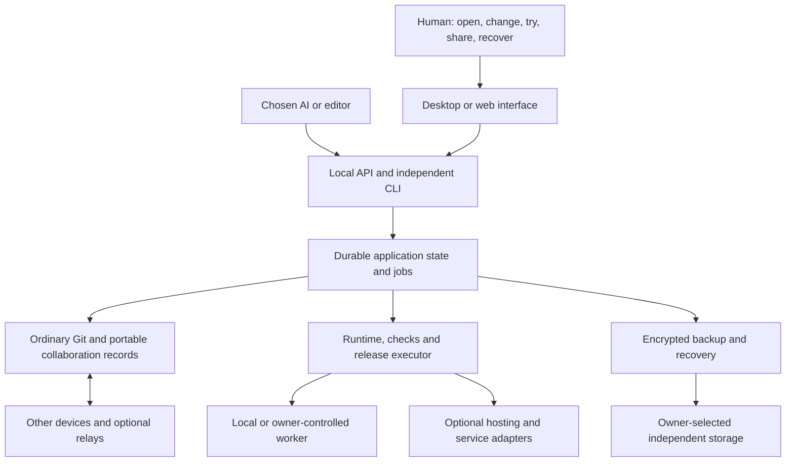

# Complete application ownership

Product and engineering proposal, 9 September 2026. This document defines the GitHub-absence product. Lanes, stacked merge, the local check graph, and observed local publish are in current source; a production Cloudflare live-ship adapter and GitHub archive are not. See [the current roadmap](ROADMAP.md), [Mac validation](MAC_VALIDATION.md), and [the source audit](COMPLETION-AUDIT.md) for that boundary.

**Built for humans. Operated by AI. Owned by you.**

## The product decision

Make a complete, working application the thing a person owns: its behavior, source, data, running environment, collaborators, changes, operating costs, and means of recovery. A repository is one component of that application.

The experience should be: **find or describe an app → make it yours → use it → improve it → share it → keep it working.** The owner should not need to learn branches, runners, container registries, connection strings, or database migrations to complete an ordinary supported task. Those details remain available to people and agents who need them.

The competitive goal is observable: an owner and collaborators can complete their software work without opening GitHub or depending on its services. Publishing Unforge's source there can remain convenient. Its control plane, collaboration, checks, releases, and recovery must work elsewhere. A second implementation must be able to operate an exported application without Unforge.

This requires a broader architecture than the current bounded Git workspace. Adding more explanatory tabs will not close the gap. Preserve the existing Git engine and native shell, and build the application lifecycle above them.

## Three capabilities that make the larger product worth building

### 1. Personal software that keeps getting better

“Make this family app work our way, and keep improvements coming.”

An owner can take a licensed reusable app, change its vocabulary, layout, accessibility, data fields and workflow, and keep receiving compatible improvements from its original maintainers. Each personalized app records its upstream version, intentional differences and examples of behavior the owner values.

An incoming fix is tried in a separate copy with synthetic data. Unforge compares both the shared app's tests and the owner's examples. Compatible changes can follow the owner's chosen update policy. When a change conflicts, show the concrete choice: “The new reminder flow removes the separate step you added.” Preserve both candidates and all partial work.

Implementation requires three distinct mechanisms: versioned preferences for presentation; explicit extension points for supported workflow changes; ordinary three-way source reconciliation for arbitrary edits. AI can propose conflict resolutions, but cannot promise that all combinations are meaningful. A silent behavioral regression must not be labeled a successful upgrade merely because the code merged.

This is also a possible network effect: one well-maintained foundation supports many private variants, and a useful public fix can reach every compatible variant. Public contributions contain only deliberately selected code and synthetic reproductions. Personal data, prompts and private modifications stay private. Licenses and attribution travel with the foundation and its derivatives.

Personal variants also need a maintenance policy: supported upstream versions, how urgent incompatible fixes are handled, and how to select another maintainer if the original disappears. Offer a tested repair or temporary feature disablement when appropriate. Measure maintainer support burden; distributing one fix must become easier than separately debugging every private fork.

**Experiment:** create three materially different variants of one app; apply an upstream dependency fix and a conflicting workflow update. All three retain their declared personal behaviors. At least one conflict is explained in terms a beginner can resolve. Measure maintenance time against three ordinary forks before claiming savings.

### 2. Software that can become simpler and cheaper

“Keep these things working; remove the services I do not need.”

Unforge should be able to propose and execute a dependency-removal project. Examples include turning an unnecessarily dynamic site into static files, replacing repeated full builds with valid cached checks, moving occasional private processing onto an owner's available machine, or replacing a hosted component with a supported local equivalent.

The system first records important behavior and availability requirements, measures the current workload, and identifies which provider-specific features actually matter. It then builds a candidate, runs equivalent user flows, compares data and performance, estimates total cost, and rehearses migration and recovery. Deployment and old-resource retirement are separate steps: moving traffic does not stop storage charges.

Start with explicit, tested transformations for supported stacks. An arbitrary managed backend cannot be converted losslessly by swapping an SDK. Authentication identities, authorization rules, scheduled work, object URLs, realtime semantics and external callbacks need their own migrations. A database export alone is insufficient.

At portfolio scale, look for duplicate services and work across the owner's apps. Shared caches, a compatible database host or a common runtime may reduce fixed cost. Each app still needs isolated credentials, data boundaries, resource quotas and independent backup. Consolidation that creates one large outage or exceeds a small computer's memory is not an improvement.

**Experiment:** eliminate one real dependency from a fixture application, preserve its required behavior, run the replacement for a measured period, and reconcile remaining resource charges. Record hardware, operator time and reliability tradeoffs alongside monetary savings.

### 3. Ownership demonstrated by moving and recovering

“Move my app,” “Use another AI,” and “Get my work back” should be ordinary actions.

Source, runtime instructions, data exports, release artifacts, identity recovery and unfinished work must be independently understandable. Practice moving a supported app to a second destination and opening it there. Exercise recovery with the original disk unavailable. Preserve useful local behavior during a network or vendor outage where the app's design supports it.

Do this quietly as part of normal release and backup work. The owner sees “Your backup opened successfully yesterday” or a specific repair action, not a mandatory evidence-management workflow. Keep detailed results available for diagnosis.

**Experiment:** remove GitHub access, replace the active AI adapter, restore onto another machine, and operate the application with an independent CLI. Separately test loss of the hosting destination. Record exactly which dependencies survive each exercise. Cached dependencies are required for the stronger claim of rebuilding with all upstream package services unavailable.

## What the owner sees

The home screen centers on applications, their useful next action, and whether the version the owner is using differs from the one being changed. The primary actions are **Open, Change, Try, Share, Recover**. Costs appear when they matter to a decision, with a portfolio view for investigation.

A change starts from the running app: select a screen or describe a frustrating task, then choose the desired result. Unforge attaches the relevant screen, code, examples and prior decisions to the selected AI. The owner tries the proposed behavior before choosing to use it. A stable navigation structure accompanies chat so that a conversation is never the only way to recover or control the app.

Language, text size, explanation depth and examples are explicit, reversible preferences. Do not infer intelligence or hide relevant facts based on a guessed aptitude. Voice and alternative input can help, but accessible keyboard and screen-reader operation are core requirements. Show fewer technical details without making incompatible data changes or new charges invisible.

An owner should be able to answer three questions at any time: “Which version am I using?”, “Where is my data?”, and “What can cost money?” The UI derives those answers from operation state rather than an agent's last conversational claim.

## Architecture that supports that experience

### An open application format

Define a versioned `unforge.app.json` schema and publish fixtures, compatibility rules and a small independent reader. The filename is proposed, not an existing supported interface. The manifest describes the app; it never stores live secrets or private datasets in source control.

| Object | Required meaning |
| --- | --- |
| Application | Stable identity, purpose, license, ownership and upstream relationship |
| Source | Git location, base and candidate revisions, external-editor relationship, large-object availability |
| Runtime | Platform, pinned tools, dependency lock, install/build/start/stop/check entry points, health and resource requirements |
| Behavior | Human examples and executable checks, fixtures, expected results and intentionally unsupported cases |
| Environment | Practice/live identity, data mounts, destinations, secret references and capability grants |
| Data | Database, uploads and other state; consistency requirements; schema compatibility; export and restore procedures |
| Release | Exact input tree, environment inputs, artifact digest, check results, migration, destination and observed live identity |
| Economics | Resource ownership, pricing timestamp, usage assumptions, enforcement coverage, retained costs and shutdown procedure |
| Collaboration | Portable proposals, reviews, discussions, decisions, attachments, participants and trust policy |
| Recovery | Backup locations, freshness, key-recovery method, restore steps and measured recovery result |

Keep immutable source, artifacts and events separate from mutable runtime data and secrets. Store durable local jobs and indexes in transactional SQLite, with large artifacts in a content-addressed directory. The SQLite database is an implementation detail, not the only export format. Large data moves through explicit streaming exports, not one increasingly large archive in memory.

Separate a person, a device key, an application ID, an environment and a release ID. A project folder name cannot serve all five roles. Local paths and cloud resource IDs belong in bindings that can be changed without changing the application's identity.

Keep source collaboration, live-app membership, data access, operating credentials and publication rights distinct. Giving someone permission to contribute code does not grant access to users' records. Existing application authentication can remain app-managed; a universal SSO retrofit is not a prerequisite.

### A reliable executor

The AI proposes work through the same interface as other tools. A deterministic executor owns processes, resource limits, immutable candidates, installation, checks and releases. Durable operation states include queued, running, succeeded, failed, cancelled and unknown outcome. Restart reconciles the world before retrying a potentially completed external action.

Use per-project transactions and a host resource scheduler. Reads of one app must not wait for another app's backup. Preserve drafts, logs and proposals across engine failure. Use compare-and-swap updates and three-way reconciliation when an editor changes the original source. Do not require paying an AI to regenerate an otherwise useful stale patch.

For this 16 GB development machine, allow one heavy build/test at a time and at most two test workers. Memory and disk quotas, bounded logs, process-group termination, sleep/wake behavior and crash recovery belong in the supervisor. A desktop app is not automatically a 24/7 host: a separately selected service host must remain independently manageable when the UI closes.

### Real practice environments and releases

A practice copy gets separate data, credentials, session identities, queues and integration destinations. Test mailboxes and simulated payment endpoints must be connected to the running application. Current built-in practice receipts do not provide that protection.

Run untrusted supported workloads behind an actual OS/VM boundary with explicit filesystem and network access. A Linux VM is a practical Mac boundary for supported service stacks; Swift native builds require a separate trusted host-build mode or stronger dedicated-host isolation. Do not run arbitrary app scripts inside the privileged management webview. A container definition or an agent's sandbox flag does not establish all these guarantees. [gVisor's security model](https://gvisor.dev/docs/architecture_guide/security/) illustrates both isolation and its limits.

Reuse check results only when source, relevant tools/dependencies, environment inputs, check definition, trust and freshness match. Impure tests must run again. A missing required check is not a cost optimization. Platform-specific artifacts require checks on the relevant platform.

A deployment uses the tested artifact, then independently observes the live release and a key user flow. Database changes need compatibility-aware migration. Some failures require a forward repair rather than a code rollback. Preserve records created after a release; restoring an old database over them is not a universal undo. Emails, payments and other external actions cannot be erased by reverting Git.

A restored rehearsal starts with outbound effects denied and background jobs paused, even when it has no public URL. Test that a restored queued message is not sent. Inventory each data mount, identity mapping, external store and artifact as included, reconstructible from retained inputs, externally rebound, intentionally excluded or unknown. Unknown requirements prevent a complete-recovery claim. Include loss of the image registry and rotated identity-provider credentials in recovery fixtures.

### Reuse infrastructure; build the missing product

| Reuse candidate | Purpose and qualification required |
| --- | --- |
| Git | Portable source history; support real repositories, worktrees, assets and external editors |
| [Radicle](https://radicle.dev/guides/protocol) | Candidate portable issues, patches and signed peer collaboration; prototype private access, key recovery, revocation and relay replacement before committing to it |
| [Forgejo](https://forgejo.org/docs/latest/user/) | Optional bridge for conventional teams; an always-on forge must not become a beginner prerequisite |
| [Dev Containers](https://containers.dev/) and optionally [Nix](https://reproducible.nixos.org/) | Existing environment descriptions and pinned inputs; neither proves arbitrary builds reproducible or safe |
| [OCI](https://specs.opencontainers.org/runtime-spec/) | Linux service artifacts; use static outputs and platform-native packages for other lanes |
| [Restic](https://restic.readthedocs.io/en/stable/045_working_with_repos.html) | Encrypted incremental backups to owner-selected storage, with consistent database exports and actual restore/open tests |
| [Automerge](https://automerge.org/docs/reference/documents/conflicts/) | Candidate concurrent notes/comments; convergent text is not conflict-free code, money, permissions or deployment authority |
| [TUF](https://github.com/theupdateframework/specification/blob/master/tuf-spec.md) | Existing update trust design; evaluate a maintained implementation, key rotation and offline recovery |

These projects establish that decentralized Git, portable environments and encrypted backup already exist. Unforge's proposed contribution is the integrated ownership experience, maintained personal variants, and tested removal of unwanted dependencies. Novelty is a product hypothesis to validate, not a claim that these building blocks were invented here.

The closest whole-app precedents matter too. [Sandstorm](https://docs.sandstorm.io/en/latest/developing/) packages dependencies and provides private app instances. [Cloudron](https://docs.cloudron.io/backups/) supports per-app backup, migration and restoration rehearsals. Whole-app ownership and “move my app” are therefore insufficient differentiators alone. Compare Unforge's source personalization, maintained variants, dependency removal and independent exports against those products combined with an AI editor, not only against raw Git commands. Where their host capabilities fit, evaluate an adapter before rebuilding equivalent hosting administration.

## Cost design: prevent the architecture from creating the bill

Choose where work runs from actual needs: personal offline use, occasional shared access, continuously reachable web service, or platform-native app. Prefer static delivery and event-driven work when behavior permits. Avoid giving every small tool its own permanent worker, database, scheduler and monitoring subscription.

Illustrative architecture comparison, checked against official documentation on 9 September 2026. These are scoped examples, not quotes for the existing private apps or authorization to provision anything. Domains, taxes, AI, messaging, extra storage and existing subscriptions are additional where used.

| Architecture | Monthly floor and illustrative expected range | Reliability, burden and runaway risk |
| --- | --- | --- |
| Reuse existing computer and storage | $0 additional platform subscription; total includes power, existing hardware/storage and any chosen AI usage | Good for personal/local work. Owner bears uptime, maintenance and recovery; sleep or Internet loss prevents reliable public service. No new compute bill, but builds can exhaust local resources. Sole production hosting requires a separate availability decision. |
| Free edge/static delivery | $0 for a compatible app staying within the chosen free quotas | Suitable only when runtime and data needs fit. Quota exhaustion can deny service. Free Workers currently allow 100,000 requests/day with 10 ms CPU/invocation; a Node/SQLite application does not automatically fit this runtime. [Official pricing](https://developers.cloudflare.com/workers/platform/pricing/) |
| Managed edge execution | $5/month account minimum; $5 for an illustrative app below 10 million monthly requests and 30 million CPU-ms, without extra paid resources | Lower server maintenance, runtime-specific adapter work. Requests and CPU above included usage can add charges; database, queue and storage costs need separate accounting. [Official pricing](https://developers.cloudflare.com/workers/platform/pricing/) |
| Managed VM service | A 512 MB shared-CPU Fly machine is approximately $3.19–$5.16/month across the displayed regional tables; 1 GB provisioned volume adds $0.15/month. Thus roughly $3.34–$5.31 for just those two continuously provisioned resources, if this memory is sufficient | One machine is not high availability. Egress, snapshots, other services and replicas add cost. Stopped machines retain billable root filesystems ($0.15/GB-month), and volumes remain billable. Autostop reduces compute, not all cost. [Official pricing](https://fly.io/docs/about/pricing/) |

Existing Cloud Run is also a legitimate reuse candidate where its availability and workload fit. Compare its actual request/instance billing mode, minimums, CPU/RAM, region, image storage and egress before migrating. There is no measured per-app forecast in this exploration. [Cloud Run pricing](https://cloud.google.com/run/pricing)

Important current distinction: Google documents preview spend caps for eligible services including Cloud Run, scoped to one project and service. Enforcement is not instantaneous; in-flight usage and retained fixed costs can still be billed. Alerts-only budgets are a different mechanism. An adapter must report current eligibility, actual configuration and these limits instead of asserting that Google has no spend controls or promising a perfect dollar ceiling. [Spend cap documentation](https://docs.cloud.google.com/billing/docs/how-to/budgets-spend-caps)

GitHub currently provides free standard hosted runners for public repositories and free use of self-hosted runners; private hosted usage has allowances and overages. Unforge should compete on ownership and efficient execution, not the incorrect premise that every GitHub repository or build costs money. [GitHub Actions billing](https://docs.github.com/en/billing/concepts/product-billing/github-actions)

The implementation needs a per-app resource graph and four honest cost states: **estimated, observed, limited by Unforge, limited by provider**. Avoid a universal green “budget protected” badge. For metered actions under our executor, reserve a conservative allowance before starting, bound tokens/time/concurrency, reconcile actual usage and keep unknown outcomes reserved until resolved. Multiple devices need an authoritative allocator or separately bounded leases; offline agents cannot each spend the full shared allowance.

Scope secrets to the brokered operations and restrict alternate network paths when claiming enforced coverage. An unrestricted program with a full provider key can bypass a local counter. Provider-side fixed costs continue when the desktop is closed. A cost-stop policy should pause optional processing or reject new metered work while retaining data and explaining availability effects. Do not delete persistent data to meet a budget.

## GitHub displacement includes people and community

Source independence alone leaves teams needing a forge. Build portable proposals, comments anchored to versions, issues, attachments, release decisions and roles. Two users must work on separate devices, exchange work through replaceable transports and retain history after moving. Revocation protects future access; it cannot retract copies already downloaded.

Public discovery should offer usable apps and contributions. A person can try a maintained app, make a private variant and propose an improvement from the screen where they noticed a problem. Maintainers receive a deliberate, redacted reproduction, candidate patch and relevant test result. Useful contributions and compatible upgrades can create a reason to participate beyond collecting repository stars.

That still requires search, accessibility, spam prevention, moderation, reporting, license attribution, maintainer identity, mirrors and recovery from abandoned projects. Signed content proves who signed it, not whether it is trustworthy. Keep indexes interchangeable and public/private publication explicit. No mandatory Unforge login, relay, AI, subscription or catalog should be needed to use already-owned apps.

A migration bridge must inventory GitHub source, issues, pull requests, review threads, release assets, LFS objects, packages and automation. Import supported records with stable references; report API/permission omissions. Translate qualified workflow steps into local checks and surface nonportable third-party actions. Secrets are re-bound, never silently exported. A Git bundle cannot be advertised as a full forge migration.

Large organizations additionally need SSO and identity lifecycle, granular permissions, external audit export, policy integration, large-repository scale, availability targets and support. Maintain this as an explicit qualification track. A universal format and adapter API can be designed early; broad organizational replacement cannot be inferred from a successful single-owner pilot.

## Work packages and completion gates

Order follows dependencies, not the number of UI features. All entries below are planned. Current alpha status is in the audit.

| Package | Concrete engineering work | Gate before calling it complete |
| --- | --- | --- |
| A. Adopt and preserve | Application schema; durable jobs/artifact store; normal folder and Git/worktree adoption; original/copy relationship; full lazy file tree; drafts; history pagination; benign templates and asset inventory | Import dirty/unborn and normal repos without losing work. Kill and reopen during edits/proposals and retain acknowledged work. Navigate a large fixture without silently missing files. |
| B. Run and change | Supervisor; static, Node+SQLite, Python-service and Swift-host adapters; pinned tools; real isolated practice; candidate reconciliation; screen-linked requests | Open and stop all four qualification lanes through Unforge. A real app behavior changes, can be tried and can be rejected. No manual launch script or orphaned process is necessary. |
| C. Test and use | Local check graph/cache; behavior runners; artifacts; local install plus one remote service target and one static target; data migration and deployment reconciliation | Request → working candidate → tests → release → observed live behavior → recovery, entirely through Unforge/CLI. Interrupt deployment stages and reconcile correctly. |
| D. Own and control costs | Encrypted off-device backup; key recovery; restored-app execution; live resource inventory; scoped spend controls; first tested dependency-removal transformation | Restore on another machine with original disk unavailable. Induce retry/traffic fixtures, verify declared limits, measure residual costs and preserve data. Move a supported app between two destinations. |
| E. Collaborate and leave | Signed peer identity; portable review/issue events; private access; conflict handling; optional relay; forge migration; independently usable export | Two people on separate devices complete a contribution and a conflicting edit; replace relay and retain history. A separately implemented reader/operator, without importing Unforge's engine or private database, can open, build and operate an exported app. |
| F. Personalize and maintain | Preferences/extensions/source-variant model; upstream tracking; upgrade rehearsal; private/public contribution boundary | Three divergent variants receive a shared fix without losing specified custom behavior. A conflict produces understandable choices and recoverable candidates. |
| G. Distribute and sustain | Signed/notarized Mac install and recoverable updater; bundled Git strategy; Windows/Linux clients; adapter SDK/conformance fixtures; optional catalog; accessibility and beginner studies | Fresh-machine onboarding without developer-tool choreography; a bad update recovers data; independent adapter passes conformance; public contribution and moderation flows work. |

Desktop distribution and usability research begin during A, not after G. Public catalog growth should follow a working private lifecycle. Cost inventory starts in A, and enforcement must precede any metered adapter's release; D expands its coverage. Data and secret isolation must precede B's practice-mode claim.

Publish adapter coverage separately for source management, running, testing, data recovery, migration and independent operation. Unsupported stacks remain useful in source-only mode with an explicit boundary. The four initial lanes do not qualify mobile distribution, GPU services, complex monorepos or distributed databases; those require additional adapters and acceptance fixtures.

The immediate implementation slice is A plus one complete Node+SQLite journey in B/C: adopt a folder, save a durable request, run a private copy, make a meaningful change, execute behavior checks, use the candidate locally, restart and recover. Implement the same lifecycle contract for the other lanes next. Do not spend the next cycle adding more inventory forms while real app execution remains an external script.

Proposed module boundaries: split project discovery/navigation out of `engine.py`; add transactional app/job storage alongside `operations.py`; persist `agent_jobs.py` artifacts before result publication; introduce runtime and check adapters; move recovery orchestration behind consistent data adapters; let `Project.jsx` display real candidate/runtime state. Preserve the working Python core until profiling or an isolation requirement justifies replacing a component. A wholesale language rewrite is not a prerequisite.

No calendar promise is justified by feature count alone. Measure the first complete slice, the two-host migration spike and the private collaboration spike, then estimate the remaining packages from observed work. These are substantial systems projects; an installed Mac shell is not evidence that they are nearly finished.

## Qualification using four distinct app lanes

Private pilot data and launch artifacts stay outside this public repository. These lanes correspond to the private pilot types without embedding their private source or records here.

| Lane | Required end-to-end demonstration |
| --- | --- |
| Document/claim web app | Synthetic account → case → document/signature → persistence → candidate upgrade → recovered case; correct sessions and no real submission from practice mode |
| Family/social web app | Two users → invitation → private/public-to-family audiences → upload → access change → restart → restored family with identical visibility rules |
| Native personal notebook | Build and open separately → save journal → quit/reopen → preserve entry and interpretation → permission/media flow where supported → restore without touching original personal data |
| Unforge managing itself | Durable request → candidate build → independent preview instance → verified update → failed-update rollback; workspace, keys, drafts, proposals and operation state survive |

The current private pilots prove useful pieces, but manual launchers, copied projects, incomplete native behavior coverage and local-only recovery do not meet these gates. Re-run qualification through the product after each adapter is connected.

## Definition of a full-use release

1. A new user completes a supported application lifecycle with GitHub credentials absent and GitHub control-plane access blocked. Offline rebuild is a separate test with dependency caches explicitly included.
2. All four qualification lanes complete through the product, including real state recovery and a self-update failure. Native and server hosting have different availability promises.
3. At least one supported service moves between two hosts with records, uploads and required behavior intact. The old host can be retired through a separate verified procedure.
4. Two independent users collaborate, resolve a conflict and retain history when the transport changes.
5. A process crash retains acknowledged local work. Disk or machine loss restores independently backed-up work using an owner-held recovery kit; distinguish “saved here” from “backed up elsewhere.” Measure recovery time and maximum lost-work interval against a declared objective. An offline device cannot guarantee protection of its latest edits against loss of that device.
6. A traffic/retry fixture cannot exceed the declared local resource grant or silently bypass its claimed metered coverage. Out-of-scope provider costs are visible.
7. At least 8 of 10 representative beginners complete import, meaningful change, try and recovery without a facilitator or terminal commands. They correctly identify live version, backup location and spending-limit coverage. This is a proposed initial threshold, not a measured result.
8. Three personal variants accept a common improvement while retaining their specified differences. The owner can leave Unforge without losing the format or ability to maintain them.

Record time to first working app, successful changes, independent recoveries, measured operating cost, required manual interventions and GitHub visits needed to finish work. Publishing a public repository is a distribution milestone. Completing these journeys is the product milestone.

## Questions this design deliberately resolves

**What if AI is unavailable?** Existing apps still run; manual edits, checks, releases and recovery remain usable. Alternate agents consume portable context and durable unfinished work. Paid inference is optional and separately metered.

**What if the desktop is asleep?** Local personal tools resume when it wakes. Remote services and remote schedules run on an explicitly selected host. The app cannot promise uninterrupted shared service from a sleeping sole host.

**What if two devices deploy?** One environment owns a current release lease/fencing token, and adapters reject superseded writers. Git merging alone cannot coordinate live database migration.

**What if sync propagates a mistake?** Independently retained encrypted backups provide recovery. Sync is not backup; backup writers should not automatically hold unrestricted deletion authority over retained recovery copies.

**What if the owner forgets a key?** Provide an independently stored recovery kit and rehearse recovery. If all key material is lost, strong encryption prevents recovery; the UI must not offer a fictional reset button.

**What if an app requires a proprietary service?** Preserve the binding and identify the limitation. A replacement is a separately tested transformation. Losing one provider does not imply every app can run unchanged offline.

**What if Unforge becomes another rent collector?** Keep core formats, local execution, migration, recovery and adapters open and independently usable. Sustainable funding can come from optional support or managed convenience; ownership and export must not depend on that purchase. This is a product-governance commitment to formalize before distribution, not a new mandatory service.

The larger product succeeds when ordinary people can keep useful software working, make it suit them, and stop paying for dependencies they no longer need—while retaining the choice to use a service when it is genuinely worth its cost.
